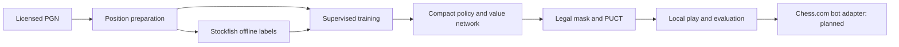

# Chess-AI

[](https://github.com/dreyvinixz/Chess-AI/actions/workflows/ci.yml)
[](LICENSE)

**A compact chess policy/value student designed for an NVIDIA GTX 1650 with 4 GB VRAM.** It learns from licensed PGN games and optional offline Stockfish labels, then chooses legal moves with its own network and optional PUCT search. Chess.com bot play is an experimental goal; no bot wins are claimed yet.

## Features

- Lossless from-square/to-square/promotion action mapping and legal move masking.
- Configurable residual CNN, CPU or CUDA inference, local terminal play, and PUCT.
- PGN preparation with game-level splits and SHA-256 source manifest.
- Offline Stockfish MultiPV policy/value labels, resumable supervised training, and checkpoint metadata.
- Random, greedy, and explicit limited-Stockfish opponents, held-out validation, student self-play, JSON match reports, speed benchmark, and system doctor.
- Fail-safe bot-only browser integration is tracked in the [roadmap](ROADMAP.md); it is not implemented yet.

## Architecture



Stockfish produces training labels and optional external baseline results. Student moves come from the network and student search.

## Hardware target

The primary target is Ubuntu under WSL2, PyTorch CUDA, and the 4 GB GTX 1650. The `gtx1650.yaml` profile uses a 64-channel, four-block network. A bounded 100-step run on a GTX 1650 Max-Q used 112 MiB peak PyTorch allocated VRAM; [benchmarks](docs/BENCHMARKS.md) give the exact scope and limitations. CPU operation is supported for CI and debugging.

## Quick start

From an Ubuntu WSL2 shell with Python 3.12 and a working NVIDIA Windows driver:

```bash
git clone https://github.com/dreyvinixz/Chess-AI.git
cd Chess-AI
bash scripts/setup_wsl.sh
source .venv/bin/activate
chess-ai doctor
chess-ai smoke-test
```

The setup script installs a CUDA 12.4 PyTorch wheel. It never installs a Linux NVIDIA driver. See [WSL2 + CUDA](docs/WSL2_CUDA.md) for prerequisites and troubleshooting. If `stockfish` is absent, `doctor` reports a warning; local play and training still work.

## Training

Use your own legally obtained standard-chess PGN, or a [Lichess CC0 export](https://database.lichess.org/). A tiny PGN is included in `examples/` for a fast functional run.

```bash
chess-ai prepare-data examples/sample.pgn --output data/processed/sample --min-elo 0
chess-ai train --dataset data/processed/sample/train.jsonl --config configs/debug.yaml --run-dir runs/demo
chess-ai play --checkpoint runs/demo/checkpoint.pt
```

For a bounded public-data experiment (17.8 MB download, 100 accepted games, 100 training steps):

```bash
python scripts/download_lichess.py --month 2013-01
chess-ai prepare-data data/raw/lichess_db_standard_rated_2013-01.pgn.zst --output data/processed/lichess-2013-01-100 --min-elo 2000 --max-games 100
chess-ai train --dataset data/processed/lichess-2013-01-100/train.jsonl --config configs/gtx1650.yaml --max-steps 100 --run-dir runs/lichess-supervised-100
```

For a real experiment, use a larger PGN and evaluate on the held-out validation/test splits. To generate teacher labels, download a verified local Stockfish 19 executable, then run:

```bash
python scripts/download_stockfish.py
chess-ai label-data data/processed/sample/train.jsonl --output data/processed/teacher.jsonl --engine stockfish --depth 8 --multipv 3
chess-ai train --dataset data/processed/teacher.jsonl --config configs/gtx1650.yaml --run-dir runs/teacher-001
```

Add `--limit 500 --sample-seed 42` to `label-data` to sample positions across a larger input file within a bounded teacher budget.

To start distillation from a supervised checkpoint with a new teacher dataset, use `--init-checkpoint runs/lichess-supervised-100/inference.pt`. `--resume` continues the **same** dataset and optimizer state; the two options serve different purposes.

The downloader checks the official release SHA-256 and stores its archive and executable under ignored `tools/stockfish-local/`. It never commits or redistributes them.

## Evaluation and benchmarks

```bash
chess-ai evaluate --checkpoint runs/demo/checkpoint.pt --opponent random --games 10
chess-ai evaluate --checkpoint runs/demo/checkpoint.pt --opponent greedy --games 10 --search puct
chess-ai evaluate --checkpoint runs/demo/checkpoint.pt --opponent stockfish --engine-depth 4 --games 2
chess-ai validate --checkpoint runs/lichess-supervised-100/inference.pt --dataset data/processed/lichess-2013-01-100/validation.jsonl
chess-ai benchmark --checkpoint runs/demo/checkpoint.pt
```

Local match results are stored in `reports/evaluation/`. These baselines measure early progress and do not establish Chess.com bot strength. See [evaluation](docs/EVALUATION.md) and [benchmarks](docs/BENCHMARKS.md).

`chess-ai self-play --checkpoint runs/demo/checkpoint.pt --games 2 --search puct --simulations 16` writes completed student-only games and an adjacent manifest. The resulting JSONL can warm-start a new run with `chess-ai train --dataset data/processed/self-play.jsonl --init-checkpoint runs/demo/checkpoint.pt --config configs/debug.yaml`. One-game fine-tuning worsened held-out value error in our proof, so compare checkpoints before adoption.

## Assist, autoplay, and bot ladder

These workflows are planned in [ROADMAP.md](ROADMAP.md). They are deliberately absent from the CLI until they can be verified against the current Chess.com computer-game UI with a fail-closed bot guard. There are no recorded Chess.com bot results yet.

## Project structure

`src/chess_ai/` contains the independent chess, model, teacher, training, search, evaluation, and CLI modules. `configs/` contains experiment profiles. `data/` holds ignored local datasets; `runs/` holds ignored checkpoints. `docs/` describes design and reproducibility. `tests/` covers the implemented behavior. `.agents/` contains the project workflow and locally vendored agent skills.

## Reproducibility

Each run stores its complete configuration, environment metadata, Git commit, dataset SHA-256, metrics CSV, and checkpoint. Dataset manifests record source hashes, position counts, filters, and split seed. See [reproducibility](docs/REPRODUCIBILITY.md).

## Documentation

- [Architecture](docs/ARCHITECTURE.md) · [Model design](docs/MODEL_DESIGN.md) · [Data](docs/DATA.md)
- [WSL2 and CUDA](docs/WSL2_CUDA.md) · [Training](docs/TRAINING.md) · [Search](docs/SEARCH.md)
- [Evaluation](docs/EVALUATION.md) · [Benchmarks](docs/BENCHMARKS.md) · [Troubleshooting](docs/TROUBLESHOOTING.md)
- [Chess.com safety boundary](docs/CHESSCOM.md) · [Contributing](CONTRIBUTING.md) · [Changelog](CHANGELOG.md)

## Safety boundary

Chess.com integration will be limited to verified computer/bot games. The future adapter must check multiple signals and stop on ambiguity, invalid FEN, or state mismatch. No automation for live human or rated games is part of this project.

## Credits and license

Built with [python-chess](https://github.com/niklasf/python-chess), [PyTorch](https://pytorch.org/), and optional [Stockfish](https://github.com/official-stockfish/Stockfish). Lichess database exports are a possible CC0 data source. Chess-AI is licensed under [GPL-3.0-or-later](LICENSE), consistent with the python-chess dependency. No Stockfish binary, weights, or third-party game database is bundled.
